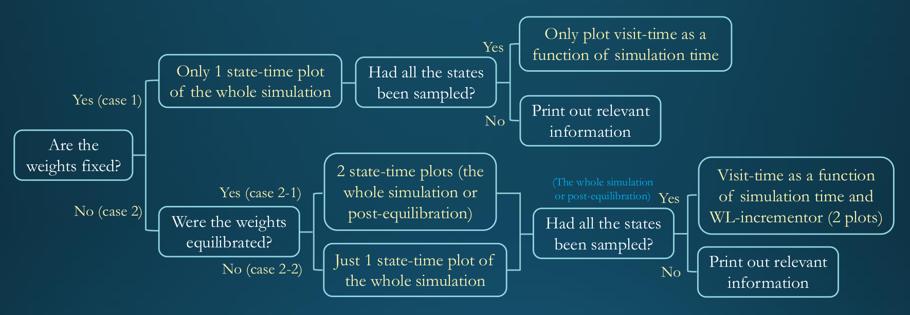

EXE_analysis
==============================
[//]: # (Badges)
[](https://travis-ci.org/REPLACE_WITH_OWNER_ACCOUNT/EXE_analysis)
[](https://ci.appveyor.com/project/REPLACE_WITH_OWNER_ACCOUNT/EXE_analysis/branch/master)
[](https://codecov.io/gh/REPLACE_WITH_OWNER_ACCOUNT/EXE_analysis/branch/master)

## Description 
`EXE_analysis` is a Python package of data analysis tools for expanded ensemble (EXE) simulations.

## Installation and Testing
All the Python scripts in this package are written in Python 3. Currently the package can be installed by following the commands below:
```
git clone https://github.com/wehs7661/EXE_analysis.git
cd EXE_analysis
pip install -e .
```
To perform the unit tests and functional tests of this package, run:
```
python test_EXE_histogram.py    ; unit tests
python test_EXE_state_plot.py   ; unit tests
bash test_EXE_histogram.py      ; functional tests
bash test_EXE_state_plot.py     ; functional tests
```

## Examples and Usage
### 1. Files in `EXE_analysis/examples`
In the folder `EXE_analysis/examples`, we provide the `.log` files and `.dhdl` files of three different cases, including files from a fixed-weight simulation, a non-fixed-weight simulation with weights equilibrated at some point and a non-fixed-weight simulation in which the weights had not been equilibrated. Theses files are the resulting files of GROMACS simulation on the files (`ethanol.gro`, `ethanol.top` and `expanded.mdp`) provided by [Alchemistry](http://www.alchemistry.org/wiki/GROMACS_4.6_example:_Ethanol_solvation_with_expanded_ensemble) (GROMACS 4.6 example: Ethanol slvation with expanded ensemble), with slight modifications on the `.mdp` file. Basically, the `.log` file and `.dhdl` file in each folder could be reproduced by running the following commands in the folder:
- `grompp` command with `maxwarn` flag to override some warnings:
(Since the `.mdp` file provided by [Alchemistry](http://www.alchemistry.org/wiki/GROMACS_4.6_example:_Ethanol_solvation_with_expanded_ensemble) produces an error of using MTTK pressure control (`pcoupl = MTTK`). Here we changed it to `Berendsen`. Accordingly, we changed the temperature control (`tcoupl`) to `v-rescale`, used `constraint-algorithm = lincs` and specified parameters relevant to LINCS algorithm.)

```
grompp -f expanded.mdp -c ethanol.gro -p ethanol.top -o ethanol.tpr -maxwarn 4
```
- `mdrun` command
```
mdrun -deffnm ethanol -dhdl ethanol_dhdl.xvg
```
For some basic analysis and insights into the resulting files, please refer [Alchemistry](http://www.alchemistry.org/wiki/GROMACS_4.6_example:_Ethanol_solvation_with_expanded_ensemble).


### 2. `EXE_histogram.py`: Data analysis of Wang-Landau incrementor and weighting factors
- To check the inputs, outputs and the description of the code, run `EXE_histogram -h`.
- To perform data analysis on `ethanol.log` using `EXE_histogram.py`, run `EXE_histogram -l ethanol.log`. If the weights were equilibrated in the simulation, then three figures named with defaults will be generated, including `WL_t_ethanol.png`, `Equil_hist_xxns_ethanol.png`, and `Final_hist_xxns_ethonl.png` as shown below, given that the last histogram was generated at about 114 ns and the weights were equilibrated at about 55 ns. If the weights were fixed or had not equilibrated in the simulation, then only the final histogram will be generated.

- Wildcards are available. Therefore, say that there are two `.log` files in the current folder, including `ethanol_0.log` and `ethanol_1.log`, to perform data analysis on both files, we can run either `EXE_histogram -l solvent_*.log` or `EXE_histogram -l *.log` (or `EXE_histogram` or `EXE_histogram -l ethanol_0.log ethanol_1.log` without using wildcards). If the weights were equilibrated in both simulations, then 6 figures will be generated. In addition, relevant information for each simulation will also be printed out.

- For example, 3 figures (`WL_t_ethanol_0.png`, `Equil_hist_xxns_ethanol_0.png` and `Final_hist_xxns_ethanol_0.png`, as shown below) will be generated by the command `EXE_histogram -l solvent_0.log` exectued in the folder `examples/Non-fixed/Equilibrated`.
<p align="center">
     <br/>
</p>
 

- Also, the `STDOUT` of the command above would be:
```
The log file(s) to be analyzed: solvent_0.log, and solvent_1.log.
Length of the simulation for the weights average calculation: 20 ns.

Data analysis of the file solvent_0.log:
========================================
The uncertainty of the free energy difference is 0.174 kT.

Or at the simulation temperature (298.15 K), the uncertainty is 0.103 kcal/mol

The weights were equilibrated at 54.937 ns

The final weights are:
  0.00000 14.56500 28.46294 41.67213 54.11278 65.79066 76.92339 87.23114 96.83672 105.77297 113.89335 121.35474 128.16594 134.20094 139.62177 144.44218 148.59055 152.19318 155.31149 157.89021 160.03456 161.06497 161.96962 162.79330 163.44638 163.69086 163.86891 163.89583 163.73541 163.55287 163.23662 162.82605 162.19519 161.42480 160.44183 159.40266 158.37007 157.29657 156.56107 156.00758

The average weights of the last 20 ns of the simulation before the weights are equilibrated (from 34.938 to 54.938 ns) are:
  0.0 14.64648 28.57863 41.79821 54.28418 66.01599 77.11028 87.46918 97.07739 106.00707 114.12933 121.61515 128.38682 134.43235 139.8606 144.69019 148.83927 152.46849 155.52978 158.09579 160.25379 161.2892 162.18532 162.97901 163.68603 163.94997 164.0765 164.11113 164.01516 163.84075 163.53011 163.11137 162.47901 161.7277 160.71876 159.73908 158.73955 157.66436 156.94407 156.40345 

Data analysis of the file solvent_1.log:
========================================
The uncertainty of the free energy difference is 0.246 kT.

Or at the simulation temperature (298.15 K), the uncertainty is 0.146 kcal/mol

The weights were equilibrated at 50.864 ns

The final weights are:
  0.00000 14.60170 28.43523 41.58579 54.08459 65.87537 76.98775 87.34401 97.00613 105.89536 114.04492 121.53658 128.34734 134.41112 139.80858 144.59074 148.78474 152.36356 155.42416 158.01062 160.16965 161.19495 162.09843 162.89775 163.52808 163.75729 163.82927 163.90205 163.76106 163.58467 163.28349 162.79807 162.18027 161.25948 160.28998 159.15817 158.14124 157.05890 156.27008 155.67805

The average weights of the last 20 ns of the simulation before the weights are equilibrated (from 30.866 to 50.866 ns) are:
  0.0 14.64105 28.54121 41.76535 54.25945 66.08005 77.21117 87.55368 97.19715 106.09082 114.29638 121.77106 128.55119 134.60321 140.06286 144.82714 149.00974 152.61477 155.64057 158.26884 160.41002 161.40118 162.33332 163.13015 163.71199 163.96416 164.08451 164.09988 163.98061 163.81325 163.52252 163.01236 162.4054 161.54296 160.49669 159.40129 158.34479 157.25842 156.47471 155.92581 

2 file(s) analyzed.
Total time elapsed (including plotting): 20.138840436935425 seconds.
```

### 3. `EXE_state_plot.py`: Data analysis of the exploration of the state
- To check the inputs, ouputs and the description of the code, run `EXE_state_plot -h`.
- To use `EXE_state_plot.py`, at least a `.log` file and a `.dhdl` file are required.
- Similar to `EXE_histogram.py`, `EXE_state_plot.py` is able to search `.log` files and their corresponding `.dhdl` file if no parameters are specified. Wildcards are also available. Therefore, the program can be invoked by commands such as `EXE_state_plot`, `EXE_state_plot -i ethanol_*_dhdl.xvg -l ethanol_*.log`, `EXE_state_plot -i *_dhdl.xvg -l *.log`, or `EXE_state_plot -i ethanol_0_dhdl.xvg ethanol_1_dhdl.xvg -l ethanol_0.log ethanol_1.log`.
- According to different situations, either fixed or non-fixed weights, euilibrated or non-equilibrated weights, different number of plots/different data analysis will be performed by `EXE_state_plot`, as shown below.
<p align="center">
     <br/>
</p>

- For example, 4 figures (`state_plot_ethanol_0_whole.png`, `state_plot_ethanol_0_truncated.png`, `visit_time_ethanol_0.png`, and `visit_time_wl_ethanol_0.png`, as shown below) will be generated the command `EXE_state_plot -i ethanol_0_dhdl.xvg -l ethanol_0.log` executed in the folder `examples/Non-fixed/Equilibrated`:
- Also, the `STDOUT` of the command above would be:


### 4. Alchemical free energy calculations
- With `dhdl` files, we are able to calculate the free energy difference between two thermodyanmic states. This calculation is now temporarily relying on the package [alchemical-analysis](https://github.com/MobleyLab/alchemical-analysis), but will move to [alchemlyb](https://github.com/alchemistry/alchemlyb) in the future.
- Using `alchemical-analysis`, to calculate the energy difference given one or more `dhdl` files with prefix as `complex`, run `alchemical_analysis -p complex_1 -t 298.15 -u kcal -w -g -x`. 
- To check the meaning of each useful flag used in `alchemical-analysis`, run `alchemical-analysis -h`.


## External Links
To get more realized about the theory and the implmentation of expanded ensemble simulation, we recommend the following resources:

- Alchemistry tutorials
  
  - [GROMACS 4.6 example: Direct ethanol solvation free energy](http://www.alchemistry.org/wiki/GROMACS_4.6_example:_Direct_ethanol_solvation_free_energy)
  - [GROMACS 4.6 example: Ethanol solvation with expanded ensemble](http://www.alchemistry.org/wiki/GROMACS_4.6_example:_Ethanol_solvation_with_expanded_ensemble)
  - [Example: Relative Binding Affinity](http://www.alchemistry.org/wiki/Example:_Relative_Binding_Affinity)
  - [Example: Absolute Solvation Free Energy](http://www.alchemistry.org/wiki/Example:_Absolute_Solvation_Free_Energy)
  - [Absolute Binding Free energy - Gromacs 2016](http://www.alchemistry.org/wiki/Absolute_Binding_Free_Energy_-_Gromacs_2016)

- Literatures (provided in the folder `EXE_analysis/papers`)

  - Some decent reviews about alchemical free energy calculation
    
    - [Aldeghi, M., Bluck, J. P., & Biggin, P. C. (2018). Absolute alchemical free energy calculations for ligand binding: A beginner’s guide. In Computational Drug Discovery and Design (pp. 199-232). Humana Press, New York, NY.](http://dx.doi.org/10.1007/978-1-4939-7756-7_11)
    - [Shirts, M. R. (2012). Best practices in free energy calculations for drug design. In Computational drug discovery and design (pp. 425-467). Springer, New York, NY.](http://dx.doi.org/10.1007/978-1-61779-465-0_26)
    - [Best Practices for Alchemical Free Energy Calculations]() (In preparation)
  - Applications and theories about expanded ensemble simulation and Wang-Landua algorithm

    - [Wang, F., & Landau, D. P. (2001). Efficient, multiple-range random walk algorithm to calculate the density of states. Physical review letters, 86(10), 2050.](https://dx.doi.org/10.1103/PhysRevLett.86.2050)
    - [Chodera, J. D., & Shirts, M. R. (2011). Replica exchange and expanded ensemble simulations as Gibbs sampling: Simple improvements for enhanced mixing. The Journal of chemical physics, 135(19), 194110.](https://dx.doi.org/10.1063/1.3660669)
    - [Monroe, J. I., & Shirts, M. R. (2014). Converging free energies of binding in cucurbit [7] uril and octa-acid host–guest systems from SAMPL4 using expanded ensemble simulations. Journal of computer-aided molecular design, 28(4), 401-415.](https://dx.doi.org/10.1007/s10822-014-9716-4)


## Copyright

Copyright (c) 2019, Wei-Tse Hsu

## Acknowledgements
 
Project based on the 
[Computational Molecular Science Python Cookiecutter](https://github.com/molssi/cookiecutter-cms) version 1.1.
