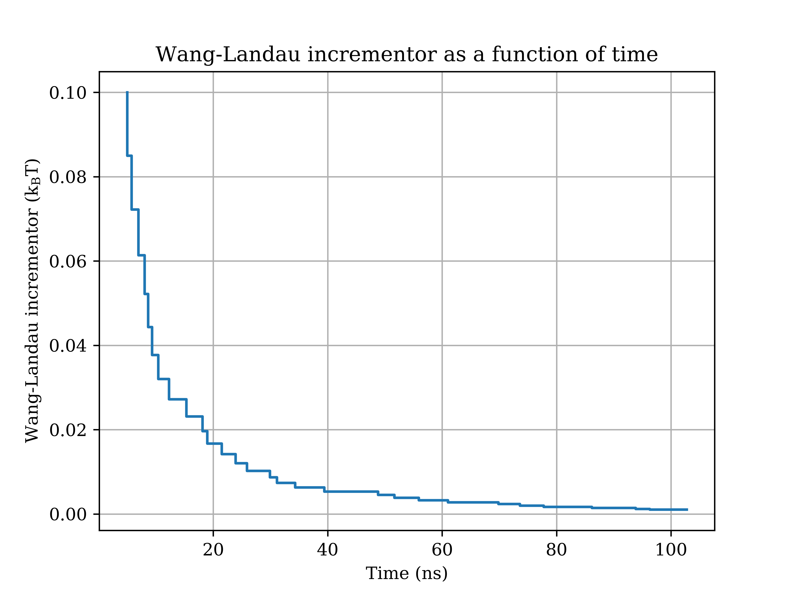
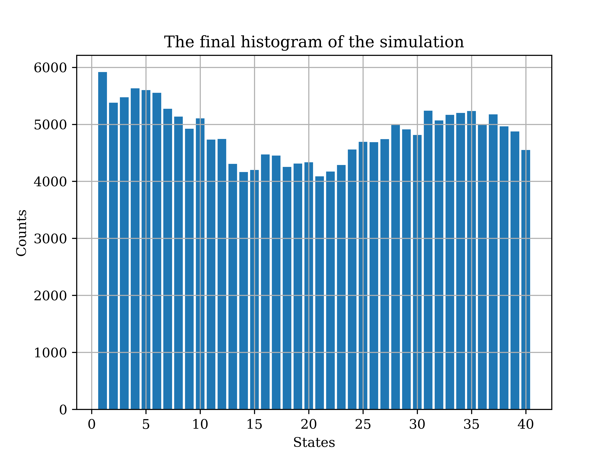

EXE_analysis
==============================
[//]: # (Badges)
[](https://travis-ci.org/REPLACE_WITH_OWNER_ACCOUNT/EXE_analysis)
[](https://ci.appveyor.com/project/REPLACE_WITH_OWNER_ACCOUNT/EXE_analysis/branch/master)
[](https://codecov.io/gh/REPLACE_WITH_OWNER_ACCOUNT/EXE_analysis/branch/master)

## Description 
`EXE_analysis` is a Python package of data analysis tools for expanded ensemble (EXE) simulations.

## Installation
All the Python scripts in this package are written in Python 3. Currently the package can be installed by following the commandes below:
```
git clone https://github.com/wehs7661/EXE_analysis.git
cd EXE_analysis
pip install -e .
```

## Examples and usage
### 1. `EXE_histogram.py`: Data analysis of Wang-Landau incrementor and weighting factor
- To check the inputs, ouputs and the description of the code, run `EXE_histogram -h`
- To perform data analysis on `complex_0.log` using `EXE_histogram.py` and print the results to `results_histo.txt`, run `EXE_histogram -l complex_0.log`. Then two figures named with defaults will be generated, including `WL_t_complex_0.png` and `Final_hist_complex_0.png` as shown below. (The log files are not provided here since the files are too large.)
- To perform data analysis on both `complex_0.log` and `complex_1.log` using `EXE_histogram.py` and print the results to `results_histo_multi.txt`, run `EXE_histogram -l complex_*.log` (or `EXE_histogram -l complex_0.png complex_1.png` without using wildcards). 4 figures will be generated.
- Example figures as the output of data analysis performed on `complex_0.log`:
 

### 2. `EXE_state_plot.py`: Data analysis of the exploration of the state
- To check the inputs, ouputs and the description of the code, run `EXE_state_plot -h`.


### 3. Alchemical free energy calculations
- With `dhdl` files, we are able to calculate the free energy difference between two thermodyanmic states. This calculation is now temporarily relying on the package [alchemical-analysis](https://github.com/MobleyLab/alchemical-analysis), but will move to [alchemlyb](https://github.com/alchemistry/alchemlyb) in the future.
- Using `alchemical-analysis`, to calculate the energy difference given one or more `dhdl` files with prefix as `complex`, run `alchemical_analysis -p complex_1 -t 298.15 -u kcal -w -g -x`. 
- To check the meaning of each useful flag used in `alchemical-analysis`, run `alchemical-analysis -h`.


## Copyright

Copyright (c) 2019, Wei-Tse Hsu


## Acknowledgements
 
Project based on the 
[Computational Molecular Science Python Cookiecutter](https://github.com/molssi/cookiecutter-cms) version 1.1.
